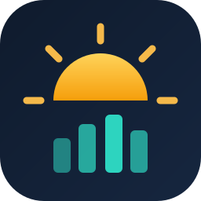

<p align="center">
  
</p>

<h1 align="center">fusionsolar-exporter</h1>

<p align="center">
  Huawei FusionSolar plant and inverter metrics for <a href="https://prometheus.io/">Prometheus</a> and Grafana.<br>
  Works with a normal FusionSolar web login. No Northbound API account needed.
</p>

---

## What it is

[Prometheus](https://prometheus.io/) is an open source monitoring system that collects numeric time series by scraping HTTP endpoints. An [exporter](https://prometheus.io/docs/instrumenting/exporters/) is a small service that sits next to a system that does not speak Prometheus, reads its data, and publishes it on a `/metrics` page in the format Prometheus understands.

`fusionsolar-exporter` does that for [Huawei FusionSolar](https://solar.huawei.com/). It signs in to the FusionSolar portal the same way your browser does, reads the same JSON the portal pages use, and exposes it as metrics. From there you can graph it in [Grafana](https://grafana.com/), alert on it, and keep history for as long as you like.

<p align="center">
  
</p>

## Why another exporter

The official way to get data out of FusionSolar is the Northbound API. It needs a separate API account that only a company administrator can create, and it is rate limited to roughly one call every five minutes. Many plant owners only have a regular portal user.

This exporter needs nothing more than that regular user, and it gets:

- Plant level power, yield (day, month, year, lifetime) and health
- Inverter AC power, temperature, grid frequency, daily and lifetime yield
- Per string PV voltage, current and power, and total DC input
- Per phase grid voltage and current
- Active alarm counts by severity
- The alarm list and inverter status changes as JSON, for tools that keep a device log
- All plants the user can see, discovered automatically

## Quick start

You need Docker with the Compose plugin.

```bash
git clone https://github.com/jaba0x/fusionsolar-exporter.git
cd fusionsolar-exporter
cp .env.example .env
# edit .env: set FUSIONSOLAR_USERNAME and FUSIONSOLAR_PASSWORD
docker compose up -d --build
```

Check that it works:

```bash
docker logs fusionsolar-exporter
curl -s localhost:9850/metrics | grep fusionsolar_up
```

A healthy start logs `logged in, portal https://...` followed by `inventory: N plants, M inverters`, and `fusionsolar_up` is `1`.

### Prometheus

Add a scrape job (see `prometheus.yml` for a full example):

```yaml
scrape_configs:
  - job_name: fusionsolar
    scrape_interval: 60s
    static_configs:
      - targets: ["fusionsolar-exporter:9850"]
```

No Prometheus yet? The Compose file ships one behind a profile:

```bash
docker compose --profile prometheus up -d --build
```

### Grafana

Import `grafana/dashboard.json` (Dashboards > New > Import) and pick your Prometheus data source. It gives you fleet totals, power and yield per plant, inverter AC and DC power, PV strings, phase voltage and current, and an inverter table.

## Configuration

Everything is set with environment variables.

| Variable | Default | Description |
|---|---|---|
| `FUSIONSOLAR_USERNAME` | required | FusionSolar portal user |
| `FUSIONSOLAR_PASSWORD` | required | Password of that user |
| `FUSIONSOLAR_LOGIN_URL` | `https://eu5.fusionsolar.huawei.com` | Login host for your region |
| `FUSIONSOLAR_PORTAL_URL` | detected | Regional portal host. Leave empty to use the one the login redirects to |
| `POLL_INTERVAL_SECONDS` | `120` | How often to poll the portal |
| `TIMEZONE_OFFSET_HOURS` | `0` | Plant time zone as a UTC offset, used for "today" values |
| `PV_STRINGS` | `8` | Number of PV string inputs to read per inverter |
| `INVENTORY_TTL_SECONDS` | `21600` | How often the device list is refreshed |
| `LOGIN_BACKOFF_SECONDS` | `1800` | Wait time after a failed login |
| `ALARM_INTERVAL_SECONDS` | `300` | How often the alarm list is read |
| `ALARM_HISTORY_DAYS` | `3650` | How far back alarms are read on the first run |
| `LISTEN_PORT` | `9850` | Port for `/metrics` and the JSON endpoints |
| `LOG_LEVEL` | `INFO` | Python log level |

If the password contains `#` or `$`, wrap it in single quotes in `.env`.

### More than one account

Run one container per account, each with its own env file and its own scrape job. If two accounts can see the same plant, filter on the `job` label in your dashboards so it is not counted twice.

## Metrics

All metrics are gauges unless noted.

| Metric | Labels | Description |
|---|---|---|
| `fusionsolar_up` | | 1 if the last poll succeeded |
| `fusionsolar_last_success_timestamp_seconds` | | Unix time of the last successful poll |
| `fusionsolar_api_errors_total` | `stage` | Counter of failed logins and polls |
| `fusionsolar_active_alarms` | `severity` | Active alarms, 1 critical to 4 warning |
| `fusionsolar_day_income` | | Revenue today, all plants |
| `fusionsolar_station_capacity_kw` | plant | Installed string capacity (kWp) |
| `fusionsolar_station_health_state` | plant | 1 disconnected, 2 faulty, 3 healthy |
| `fusionsolar_station_active_power_kw` | plant | Current power |
| `fusionsolar_station_day_energy_kwh` | plant | Yield today |
| `fusionsolar_station_month_energy_kwh` | plant | Yield this month |
| `fusionsolar_station_year_energy_kwh` | plant | Yield this year |
| `fusionsolar_station_total_energy_kwh` | plant | Lifetime yield |
| `fusionsolar_inverter_run_state` | inverter | 0 disconnected, 1 connected |
| `fusionsolar_inverter_active_power_kw` | inverter | AC output power |
| `fusionsolar_inverter_rated_power_kw` | inverter | Rated power |
| `fusionsolar_inverter_day_energy_kwh` | inverter | Yield today |
| `fusionsolar_inverter_total_energy_kwh` | inverter | Lifetime yield |
| `fusionsolar_inverter_temperature_celsius` | inverter | Internal temperature |
| `fusionsolar_inverter_grid_frequency_hz` | inverter | Grid frequency |
| `fusionsolar_inverter_dc_input_power_kw` | inverter | Total DC input, sum over PV strings |
| `fusionsolar_inverter_pv_power_kw` | inverter, `pv` | PV string power |
| `fusionsolar_inverter_pv_voltage_volts` | inverter, `pv` | PV string voltage |
| `fusionsolar_inverter_pv_current_amps` | inverter, `pv` | PV string current |
| `fusionsolar_inverter_phase_voltage_volts` | inverter, `phase` | Grid phase voltage (A, B, C) |
| `fusionsolar_inverter_phase_current_amps` | inverter, `phase` | Grid phase current (A, B, C) |

Plant labels are `station_code` and `station_name`. Inverter labels add `device_id` and `device_name`.

## Alarms and status changes

Prometheus stores numbers, so messages are served separately as JSON on the same port. Anything that wants a device log (a small web app, a script, a cron job) can read them.

| Endpoint | Returns |
|---|---|
| `GET /api/alarms` | Active alarms and the alarm history the portal still has |
| `GET /api/alarms?since=<unix time>` | Active alarms, plus those raised or cleared since that time |
| `GET /api/events?since=<unix time>` | Inverter status changes seen since that time, for example `Standby: no sunlight` to `On-grid` |

```json
{
  "updated": 1790926529,
  "alarms": [
    {
      "id": "1459031387",
      "station_code": "NE=12345678",
      "station_name": "Plant A",
      "device_id": "NE=12345680",
      "device_name": "INV-1",
      "device_type": "Inverter",
      "sn": "6T00000000",
      "alarm_id": "2012",
      "name": "String current backfeed",
      "severity": 4,
      "occurred": 1790515706,
      "cleared": 1790515791,
      "detail": "Alarm No.:792"
    }
  ]
}
```

`severity` is 1 critical, 2 major, 3 minor, 4 warning. `cleared` is `null` while the alarm is active. Times are Unix seconds.

Things to keep in mind:

- The portal keeps alarm history for a limited time (about two months in my case). Store the alarms on your side if you need them longer.
- Status changes are detected by the exporter while it runs and are kept in memory (the last 5000). They start empty after a restart, so read them regularly.
- Like `/metrics`, these endpoints have no authentication. Keep the port inside your monitoring network.

## Good to know

- **This is not an official API.** The exporter uses the endpoints behind the web portal. Huawei can change them at any time and break it. If that happens, please open an issue.
- **Use a dedicated user.** Create a separate read-only portal user for the exporter. Sharing a login with a person can log one of them out, and you do not want your main password in an env file.
- **Captcha.** After several failed logins the portal asks for a captcha, which the exporter cannot solve. It backs off for 30 minutes after any failed login to avoid that. If it happens, sign in once in a browser and wait.
- **Be polite.** The default two minute poll interval is plenty, since inverters report to the cloud every few minutes anyway.
- **Tested with** SUN2000 string inverters behind a Smart Dongle on the EU5 region. Batteries, meters and optimizers are not collected yet. Reports from other regions and devices are welcome.

## Running without Docker

```bash
pip install requests prometheus-client cryptography
export FUSIONSOLAR_USERNAME=... FUSIONSOLAR_PASSWORD=...
python exporter.py
```

## License

[MIT](LICENSE)

This project is not affiliated with or endorsed by Huawei. FusionSolar is a trademark of its owner.
